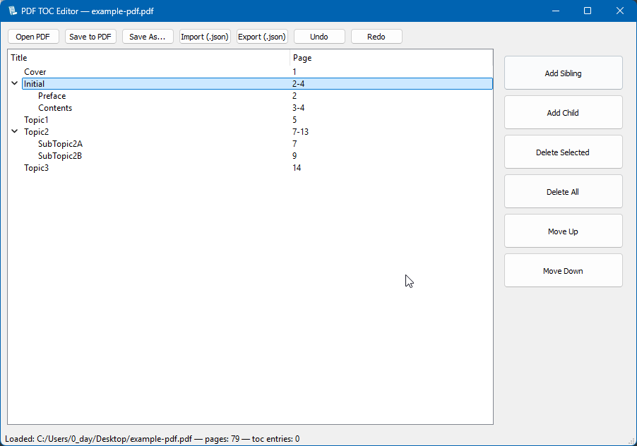

# 📑 PDF TOC Editor

A **PyQt5 desktop application** to view, edit, and manage the **Table of Contents (TOC)** of PDF files.



---
## Features
- Open any PDF and view its existing TOC.
- **Edit TOC**: add, rename, delete, move, or nest entries.
- **Drag & drop reordering** of TOC entries.
- **Undo/Redo** support for changes.
- **Import/Export TOC** in JSON format.
- Save the modified TOC **directly into the PDF**.
- Keyboard shortcuts:
  - `Ctrl + A` → Select all TOC items
  - `Delete` → Delete selected items
  - `Ctrl + ↑ / ↓` → Move items up/down
---
## How It Works
- Uses **PyMuPDF (`fitz`)** to parse and modify PDF TOC entries.
- TOC is represented hierarchically in a **tree view widget** (editable by double-click).
- Supports both **single page references** and **page ranges** (e.g., `5-10`).
- Saves changes **incrementally** (`saveIncr`) to avoid rewriting the whole file.
---
## Usage
1. Install dependencies:
   ```bash
   pip install PyQt5 PyMuPDF
2. Run the script: `main.py`
3. Open a PDF → Edit TOC → Save changes.

   Example TOC Export (JSON)
   ```
    [
       [1, "Chapter 1", 1],
       [1, "Chapter 2", 5],
       [2, "Section 2.1", 6],
       [2, "Section 2.2", 10],
       [1, "Chapter 3", 15]
    ]
   ```

## Notes
-   Page ranges in TOC (`x-y`) are accepted but only the **start page** is stored in the PDF TOC format.
-   By clicking `Save to PDF` edits are saved directly into the opened PDF (no copy is made).
-   If you want a backup, Click `Save As...` instead.

&copy; Icon downloaded from https://www.emoji.co.uk
